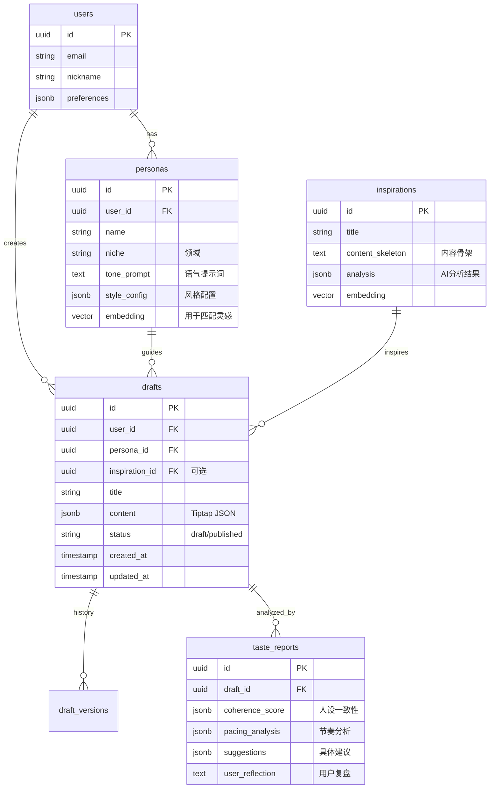

# Flowark 系统架构设计文档 (System Architecture)

> **设计原则 (The Anti-Glinta Principles)**:
> 1.  **聚合 (Integration)**: 所有 AI 能力必须内嵌于工作流，拒绝工具箱式的割裂体验。
> 2.  **辅助 (Assistance)**: AI 提供选项与诊断，绝不直接生成最终结��。
> 3.  **成长 (Growth)**: 架构需支持数据回流与品味建模，服务于用户的长期迭代。

## 1. 技术栈选型 (Tech Stack)

为了实现“沉浸式”、“流式响应”和“极简主义”的体验，我们采用以下现代 Web 技术栈：

### 1.1 前端 (Frontend)
*   **Framework**: **Next.js 14+ (App Router)**
    *   *理由*: 优秀的 SEO（利于官网），强大的服务端组件 (RSC) 性能，以及 Vercel 生态的无缝集成。
*   **Styling**: **Tailwind CSS**
    *   *理由*: 原子化 CSS 完美契合“去框化”和高度定制的设计需求。
*   **Animation**: **Framer Motion**
    *   *理由*: 实现“呼吸感”交互（如 AI 思考时的微光、文字流出的动效）的关键库。
*   **State Management**: **Zustand**
    *   *理由*: 轻量级，适合管理编辑器状态和 AI 流式数据。

### 1.2 核心编辑器 (The Heart)
*   **Engine**: **Tiptap (Based on ProseMirror)**
    *   *理由*: **这是最关键的选型**。
    *   **Headless**: 完全无 UI，允许我们 100% 自定义“纸感”界面。
    *   **Extension System**: 极其强大的插件系统，允许我们将 AI 交互（如“指令面板”、“实时润色”、“结构高亮”）封装为编辑器插件，实现真正的**内嵌式体验**。

### 1.3 后端与数据 (Backend & Data)
*   **BaaS**: **Supabase**
    *   **Database**: PostgreSQL (关系型数据存储)。
    *   **Auth**: 极简的社交/邮箱登录。
    *   **Vector Store**: pgvector (用于存储人设向量和灵感向量，实现语义搜索)。
    *   **Realtime**: 支持多端同步（未来扩展协作的基础）。

### 1.4 AI 基础设施 (AI Infrastructure)
*   **SDK**: **Vercel AI SDK**
    *   *理由*: 专为 Next.js 设计，完美支持 Streaming UI（流式输出），让 AI 的生成过程像“打字机”一样自然，减少用户的等待焦虑。
*   **Models**:
    *   **Reasoning/Chat**: Claude 3.5 Sonnet / GPT-4o (用于复杂的品味诊断、结构拆解)。
    *   **Fast Editing**: GPT-4o-mini / Claude 3 Haiku (用于实时的润色、续写，低延迟)。

---

## 2. 系统模块架构 (Module Architecture)

### 2.1 人设引擎 (Persona Engine) - *Global Context*
*   **定位**: 不是一个独立的功能页面，而是一个**全局中间件 (Middleware)**。
*   **机制**:
    *   用户创建人设后，系统生成一份 `System Prompt` 片段（包含语气、禁忌、风格）。
    *   **每一次** AI 请求（无论是润色、灵感推荐还是诊断），都会自动注入当前激活的人设 Context。
    *   *避免了 Glinta 的割裂感：用户不需要反复告诉 AI “我是谁”。*

### 2.2 灵感策展器 (Inspiration Curator) - *The Input*
*   **定位**: 结构化的灵感数据库。
*   **流程**:
    1.  **Ingest**: 爬虫/API 获取外部热点（MVP 阶段可模拟）。
    2.  **Process**: AI 分析热点，提取“骨架结构”和“爆款逻辑”。
    3.  **Match**: 基于 pgvector，将灵感与用户的人设进行匹配。
    4.  **Feed**: 在首页展示经过筛选的、带有“品味标签”的灵感卡片。

### 2.3 沉浸式编辑器 (Immersive Editor) - *The Core*
*   **UI 布局**:
    *   **中央画布**: 纯净的 Tiptap 编辑区。
    *   **隐形指令栏**: 选中文字或输入 `/` 唤起 AI 指令（润色、扩写）。
    *   **侧边流 (Side Stream)**: 右侧隐形侧边栏，用于展示 AI 的“思考过程”、“结构建议”和“实时诊断”。*绝不弹窗打断心流。*
*   **多模态视图**:
    *   **Doc View**: 纯文本模式。
    *   **Script View**: 自动将文本解析为“分镜卡片”流。

### 2.4 品味决策系统 (Taste Decision System) - *The Feedback*
*   **触发时机**: 用户点击“完成”或主动请求“诊断”时。
*   **分析管线**:
    1.  **Snapshot**: 获取当前文档内容。
    2.  **Analyze**: 并行调用多个 AI Agent 进行维度分析（人设一致性、节奏、结构）。
    3.  **Report**: 生成结构化的 JSON 报告，前端渲染为可视化图表（雷达图、波形图）。
    4.  **Archive**: 将报告存入 `taste_reports` 表，用于长期追踪。

---

## 3. 数据库模型设计 (Data Schema)



## 4. AI 交互流设计 (AI Interaction Flow)

### 场景：用户觉得一段话写得太平淡

1.  **User Action**: 选中一段文字，点击浮动菜单的“润色 (Polishing)”。
2.  **Client**: 发送请求到 `/api/ai/polish`。
    *   Payload: `{ selection: "...", context: "前文...", persona_id: "..." }`
3.  **Server (AI)**:
    *   检索 Persona 的 `tone_prompt` (例如：“知性、温暖、不使用网络烂梗”)。
    *   构建 Prompt: "作为[Persona]，请润色以下文字，使其更具画面感，但保持克制..."
    *   调用 LLM (Streaming)。
4.  **Client (Editor)**:
    *   在选中文字下方，以**“幽灵文字 (Ghost Text)”**或**“侧边批注”**的形式流式显示建议。
    *   用户可以选择 **"Accept" (替换)**, **"Refine" (继续对话)**, 或 **"Discard" (忽略)**。
    *   *关键点：AI 的建议永远是“建议”，必须由用户点击确认才会生效。*

---

## 5. 目录结构规划 (Directory Structure)

```
/
├── app/
│   ├── (auth)/          # 登录注册
│   ├── (dashboard)/     # 仪表盘 (灵感/数据)
│   ├── editor/          # 核心编辑器
│   │   ├── [id]/
│   │   │   ├── page.tsx
│   │   │   ├── _components/
│   │   │   │   ├── TiptapEditor.tsx
│   │   │   │   ├── AISidebar.tsx
│   │   │   │   └── BubbleMenu.tsx
│   ├── api/             # AI 接口
│   │   ├── chat/        # 通用对话
│   │   ├── completion/  # 文本补全
│   │   └── diagnose/    # 品味诊断
├── components/
│   ├── ui/              # 基础 UI 组件 (Button, Input...)
│   ├── business/        # 业务组件 (PersonaCard, InspirationCard)
├── lib/
│   ├── supabase/        # 数据库客户端
│   ├── ai/              # Prompt 模板与 AI 工具函数
│   └── hooks/           # 自定义 Hooks (use-editor, use-persona)
├── types/               # TS 类型定义
└── docs/                # 文档